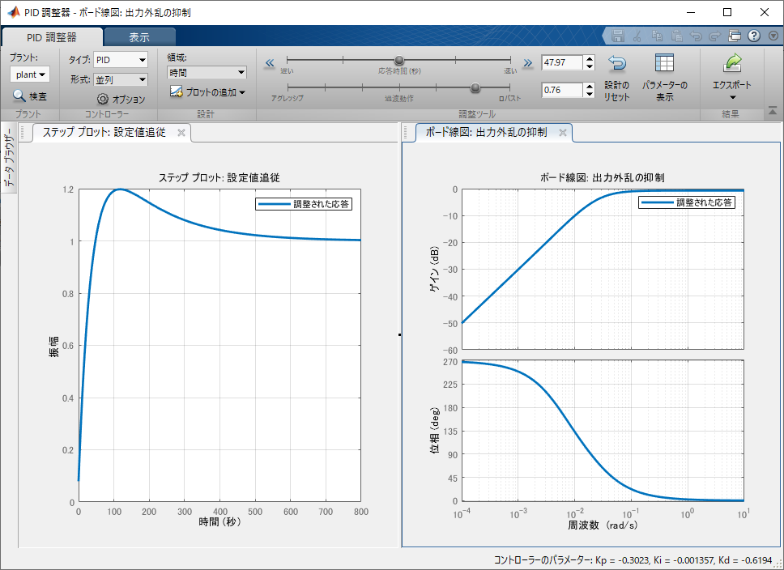

# CarND-Controls-PID
Self-Driving Car Engineer Nanodegree Program

---

## Dependencies

* cmake >= 3.5
 * All OSes: [click here for installation instructions](https://cmake.org/install/)
* make >= 4.1(mac, linux), 3.81(Windows)
  * Linux: make is installed by default on most Linux distros
  * Mac: [install Xcode command line tools to get make](https://developer.apple.com/xcode/features/)
  * Windows: [Click here for installation instructions](http://gnuwin32.sourceforge.net/packages/make.htm)
* gcc/g++ >= 5.4
  * Linux: gcc / g++ is installed by default on most Linux distros
  * Mac: same deal as make - [install Xcode command line tools]((https://developer.apple.com/xcode/features/)
  * Windows: recommend using [MinGW](http://www.mingw.org/)
* [uWebSockets](https://github.com/uWebSockets/uWebSockets)
  * Run either `./install-mac.sh` or `./install-ubuntu.sh`.
  * If you install from source, checkout to commit `e94b6e1`, i.e.
    ```
    git clone https://github.com/uWebSockets/uWebSockets 
    cd uWebSockets
    git checkout e94b6e1
    ```
    Some function signatures have changed in v0.14.x. See [this PR](https://github.com/udacity/CarND-MPC-Project/pull/3) for more details.
* Simulator. You can download these from the [project intro page](https://github.com/udacity/self-driving-car-sim/releases) in the classroom.

Fellow students have put together a guide to Windows set-up for the project [here](https://s3-us-west-1.amazonaws.com/udacity-selfdrivingcar/files/Kidnapped_Vehicle_Windows_Setup.pdf) if the environment you have set up for the Sensor Fusion projects does not work for this project. There's also an experimental patch for windows in this [PR](https://github.com/udacity/CarND-PID-Control-Project/pull/3).

## Basic Build Instructions

1. Clone this repo.
2. Make a build directory: `mkdir build && cd build`
3. Compile: `cmake .. && make`
4. Run it: `./pid`. 

Tips for setting up your environment can be found [here](https://classroom.udacity.com/nanodegrees/nd013/parts/40f38239-66b6-46ec-ae68-03afd8a601c8/modules/0949fca6-b379-42af-a919-ee50aa304e6a/lessons/f758c44c-5e40-4e01-93b5-1a82aa4e044f/concepts/23d376c7-0195-4276-bdf0-e02f1f3c665d)

## Reflections

### Describe the effect each of the P, I, D components had in your implementation.

The P control moves the car to the center of the road. The I control tries to remove the residual deviation that occurs in the P control and keep it at the center of the road.　The D control increases the feedback gain when the CTE value suddenly increases such as a curve. Using the above effects, I completed the course without course out.


### Describe how the final hyperparameters were chosen.

I tuneed the PID parameters using the step response method. In the method, I plotted the correspondence between CTE and steer_value when the steering value is changed from 0 to 1 in a short time. In my code, after 100 steps from the start of simulation, the value of steer_value was changed from 0 to 1. To test the step response, set impluse_ = true in the Init function of the PID class.

I saved the plot data in CSV format and tuned the PID parameters with matlab.
The plot data and the matlab script are described below.

plot data
```

0,0.76
0,0.76
0,0.7599
...

0,0.8905
0,0.9066
1,0.9175
1,0.9342
...

1,8.2985
1,8.4681
```

matlab scripts
1. stepd=csvread('./res/step_input_output.csv')
2. us=stepd(:,1)
3. ys=stepd(:,2)
4. Ts=0.06
5. plant_data = iddata(ys, us, Ts)
6. plant_data_detrended = detrend(plant_data)
7. plant = ssest(plant_data_detrended, 2)
8. pidTuner(plant(or mtf), 'PID')

First, I read plot data, and set the input value "us" (steer_value) and the output value "ys" (CTE) (1-3).
Also, I defined the loop interval time as Ts (0.06 msec) from the actual measurement value (4).
Next, the car has a slight leftward curve at the start, so there is a trend in CTE values.
I remove the trend using [detrend function] (https://jp.mathworks.com/help/matlab/ref/timeseries.detrend.html) (5-6).
Finally, the system is identified as a quadratic linear model and I tuned the PID parameters (7-8).
I used [ssest function] (https://www.mathworks.com/help/ident/ref/ssest.html) to estimate this state model.
In the PID parameter tuning, the following screen is displayed and I can tuned PID parameters.



First, I tried the default PID paramters, but the vehicle swing slightly at full speed. This is because the step response was measured at 6.5 mph, and the CTE sensitivity to the steer_value is high when the top speed. For this reason, the tracking performance of the PID tuner was slightly reduced (D value was reduced) to suppress swinging. The tuned parameters are described below.

- Parameter(1st try)
  * Kp = 0.302186592187861
  * Ki = 0.001258975213386
  * Kd = 0.968850913467322
- Parameter(Tuned)
  * Kp = 0.302284051053023
  * Ki = 0.001357177163598
  * Kd = 0.619445128276012


## Editor Settings

We've purposefully kept editor configuration files out of this repo in order to
keep it as simple and environment agnostic as possible. However, we recommend
using the following settings:

* indent using spaces
* set tab width to 2 spaces (keeps the matrices in source code aligned)

## Code Style

Please (do your best to) stick to [Google's C++ style guide](https://google.github.io/styleguide/cppguide.html).

## Project Instructions and Rubric

Note: regardless of the changes you make, your project must be buildable using
cmake and make!

More information is only accessible by people who are already enrolled in Term 2
of CarND. If you are enrolled, see [the project page](https://classroom.udacity.com/nanodegrees/nd013/parts/40f38239-66b6-46ec-ae68-03afd8a601c8/modules/f1820894-8322-4bb3-81aa-b26b3c6dcbaf/lessons/e8235395-22dd-4b87-88e0-d108c5e5bbf4/concepts/6a4d8d42-6a04-4aa6-b284-1697c0fd6562)
for instructions and the project rubric.

## Hints!

* You don't have to follow this directory structure, but if you do, your work
  will span all of the .cpp files here. Keep an eye out for TODOs.

## Call for IDE Profiles Pull Requests

Help your fellow students!

We decided to create Makefiles with cmake to keep this project as platform
agnostic as possible. Similarly, we omitted IDE profiles in order to we ensure
that students don't feel pressured to use one IDE or another.

However! I'd love to help people get up and running with their IDEs of choice.
If you've created a profile for an IDE that you think other students would
appreciate, we'd love to have you add the requisite profile files and
instructions to ide_profiles/. For example if you wanted to add a VS Code
profile, you'd add:

* /ide_profiles/vscode/.vscode
* /ide_profiles/vscode/README.md

The README should explain what the profile does, how to take advantage of it,
and how to install it.

Frankly, I've never been involved in a project with multiple IDE profiles
before. I believe the best way to handle this would be to keep them out of the
repo root to avoid clutter. My expectation is that most profiles will include
instructions to copy files to a new location to get picked up by the IDE, but
that's just a guess.

One last note here: regardless of the IDE used, every submitted project must
still be compilable with cmake and make./

## How to write a README
A well written README file can enhance your project and portfolio.  Develop your abilities to create professional README files by completing [this free course](https://www.udacity.com/course/writing-readmes--ud777).

